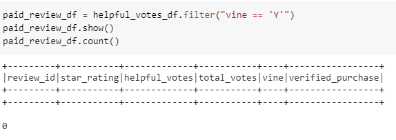
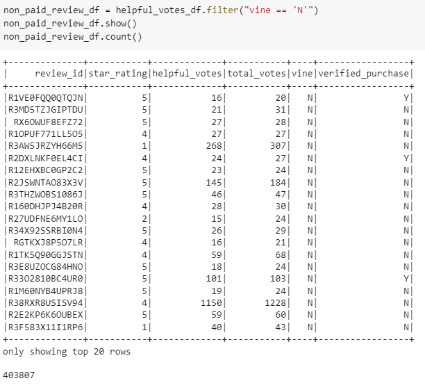
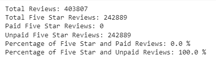

# Amazon_Vine_Analysis

# Overview of the Analysis
This analysis was completed to determine if there is any bias towards reviews that were written as part of the Vine program.  The analysis was to determine if having a paid Vine review makes a difference in the percentage of 5-star reviews.

## Results of the Analysis

### Vine vs. non-Vine Reviews

There was a total of 403,807 reviews used for our analysis.

  Vine (paid) Reviews = 0
  
  
  
  
  
  Non-Vine (unpaid) Reviews = 403,807
  
  

### 5 Star Ratings by Vine Review Status (Vine (paid) vs. non-Vine (unpaid))
There was a total of 242,889 reviews that were a Five Star Rating:

   Vine Reviews (paid) and 5 Star Rating = 0
   
   Non-Vine Reviews (unpaid) and 5 Star Rating = 242,889
   
### Percentage of 5 Star Reviews by Vine Status (Vine (paid) vs. non-Vine (unpaid))
   Percentage of Vine Reviews (paid) and 5 Star Rating = 0%
   
   Non-Vine Reviews (unpaid) and 5 Star Rating = 100%
   
   

## Summary of Analysis
Unfortunately, the data set chosen to conduct this analysis resulted in there being no paid reviews (Vine).  Therefore, it is difficult to make a determination as to whether or not there is any positivity bias for reviews in the Vine program. To take this analysis a step further using this same dataset, we can remove the filters used (i.e. removing those that have less than 20 votes) to see if there were any paid reviewers in the entire dataset.  Ultimately, my recommendation would be to choose another dataset (one that included both Vine and non-Vine reviews) to analyze and would then be a better indicator to make a determination of positivity bias being present or not.
